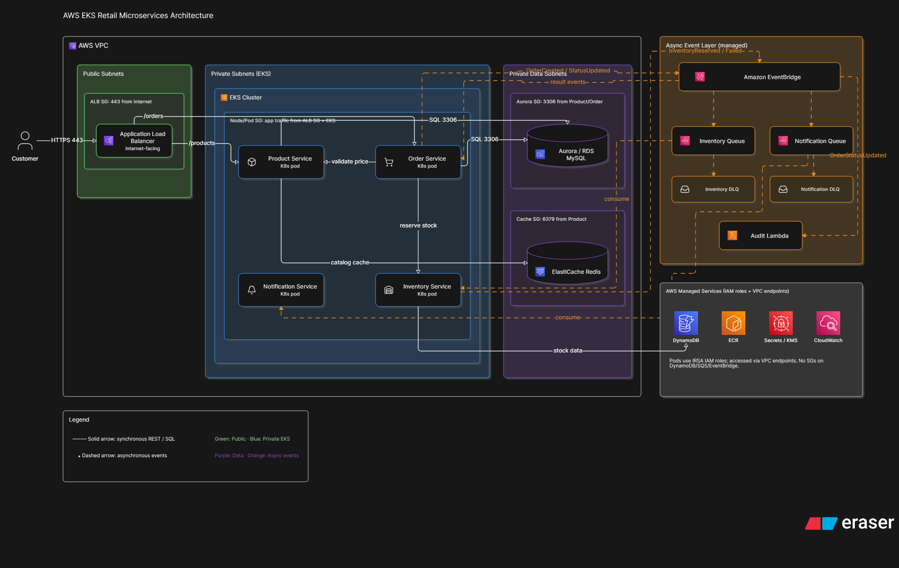

# Architecture



[Open the editable Eraser diagram](https://app.eraser.io/workspace/9CRHIYLWJjxIQj5I8kZp).

The diagram illustrates the broader target architecture. Some services drawn there are
planned and are not provisioned by the current Terraform.

## Provisioned now

- VPC with public/private subnets, one NAT gateway, and EKS Fargate profiles for
  `kube-system` and the application namespace.
- Six ECR repositories for the app services.
- Private single-AZ RDS MySQL instance with a Secrets Manager-managed master credential,
  DynamoDB inventory table, and private Valkey Serverless cache.
- Order-events SQS queue and DLQ, and an EventBridge bus.
- Secrets Manager entries for trip-planner provider credentials.
- ACM DNS-validated certificate, AWS Load Balancer Controller, ExternalDNS, and a
  storefront Ingress. Route 53 points the configured hostname to the ALB.

Request path:

```text
Client --HTTPS--> Route 53 hostname --> ALB / ACM --> EKS Ingress
                                                  --> storefront Service --> pod
```

The ALB redirects HTTP requests to HTTPS. TLS terminates at the ALB; ALB-to-pod traffic
uses the cluster's internal HTTP service port.

## Planned, not provisioned

The RDS instance is dev-sized (`db.t3.micro`, single-AZ, 20 GiB gp3) with one day of
automated backups. Valkey Serverless has 1 GiB storage and 1,000 eCPU/second usage caps.
Both are private and accept connections only from the EKS cluster security group used by
Fargate Pods. Fargate Pods run in private subnets through the NAT gateway. Expect ongoing
charges while these resources exist; the configured limits reduce capacity, not charges to
zero.

The messaging resources are infrastructure foundations only. EventBridge rules/targets,
queue consumers, SES identity verification and email delivery, and Kubernetes
NetworkPolicies are not provisioned yet. Implement those alongside the order and
notification service contracts so the asynchronous path can be tested end to end.
