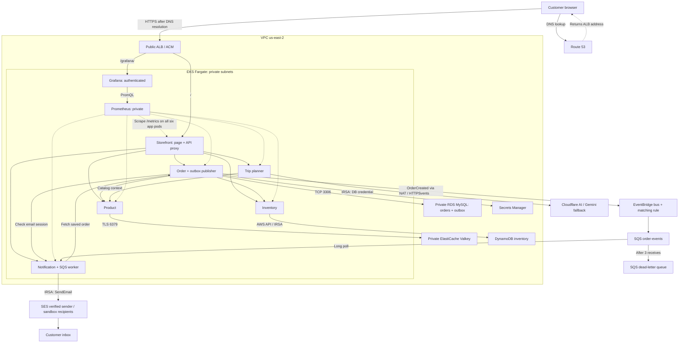
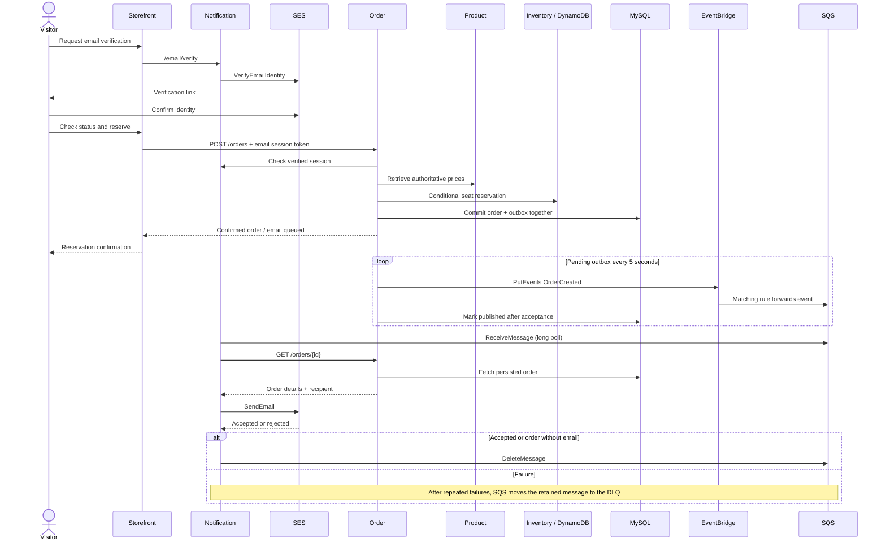
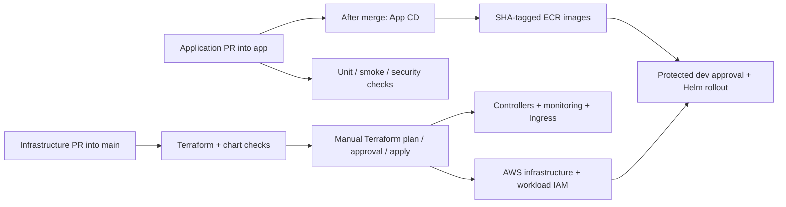

# Current architecture

These diagrams describe the implemented paths plus the monitoring included in this PR.
Monitoring requires deployment. Historical Eraser/PNG assets are retained for reference
but are not authoritative. Edit this Mermaid source with the code changes.

## Runtime topology

Route 53 resolves names rather than forwarding HTTP. ALB TLS ends at the public listener.
The ALB routes directly to Fargate pod IPs selected by Kubernetes Services/Ingress.
MySQL and Valkey are private managed services outside the EKS cluster.
DynamoDB, EventBridge, SQS and SES are regional AWS services accessed through their APIs.

## Reservation and asynchronous delivery

SES acceptance does not guarantee final inbox delivery. User evidence confirmed a reservation
email in Gmail. Events/messages and sends may duplicate; there is no exactly-once guarantee.

## Delivery and security ownership

Require application CI before merge. CI and CD are separate workflows.
OIDC gives GitHub short-lived deployment credentials. IRSA gives each AWS-integrated app its
runtime permissions. A broader deployment role does not fix a denied notification runtime role.

## Explicit exclusions and constraints

No SNS topic/fanout, API Gateway, Lambda, Istio or Kinesis appears on the current deployed path.
EKS has no EC2 managed node group. RDS is single-AZ. Verification sessions and metrics storage
are ephemeral. The diagram describes a demonstrator, not a production availability commitment.
